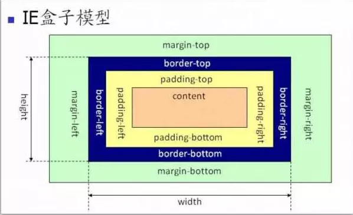

# CSS

* [盒模型](#盒模型)
* [获取文档或者元素的宽高](#获取文档或者元素的宽高)
* [位置 Position]()
* [Flex 弹性布局](./Docs/Flex.md)
* [Grid 网格布局](./Docs/Grid.md)
* [Transform](./Docs/Transform.md)
* [Transition](./Docs/Transition.md)
* [Animation](./Docs/Animation.md)
* 常见布局
    >1 . [左边固定，右边自适应]()  
    >2 . [固定页脚在文档以及窗口底部]()  
* [常用 CSS 效果 Demos]()

## 盒模型

> 两者的区别在于 width 的不同，IE盒模型的 width 包括 border、padding

```css
 /*IE模型*/
box-sizing:border-box;
/* 标准模型 */
box-sizing:content-box;
```




## 获取文档或者元素的宽高

### 获取元素宽高的几种方式

- dom.style.width/height 　　这种方式只能取到dom元素内联样式所设置的宽高，也就是说如果该节点的样式是在style标签中或外联的CSS文件中设置的话，通过这种方法是获取不到dom的宽高的。
- dom.currentStyle.width/height 　　这种方式获取的是在页面渲染完成后的结果，就是说不管是哪种方式设置的样式，都能获取到。但这种方式只有IE浏览器支持。
- window.getComputedStyle(dom).width/height 　　这种方式的原理和2是一样的，这个可以兼容更多的浏览器，通用性好一些。
- dom.getBoundingClientRect().width/height 　　这种方式是根据元素在视窗中的绝对位置来获取宽高的
- dom.offsetWidth/offsetHeight 　　最常用的，也是兼容最好的。

### 获取屏幕或者文档相关的宽高

- 获取屏幕的高度和宽度（屏幕分辨率）： window.screen.height/width
- 获取屏幕工作区域的高度和宽度（去掉状态栏）： window.screen.availHeight/availWidth
- 网页全文的高度和宽度： document.body.scrollHeight/Width
- 滚动条卷上去的高度和向右卷的宽度： document.body.scrollTop/scrollLeft
- 网页可见区域的高度和宽度（不加边线）： document.body.clientHeight/clientWidth
- 网页可见区域的高度和宽度（加边线）： document.body.offsetHeight/offsetWidth
