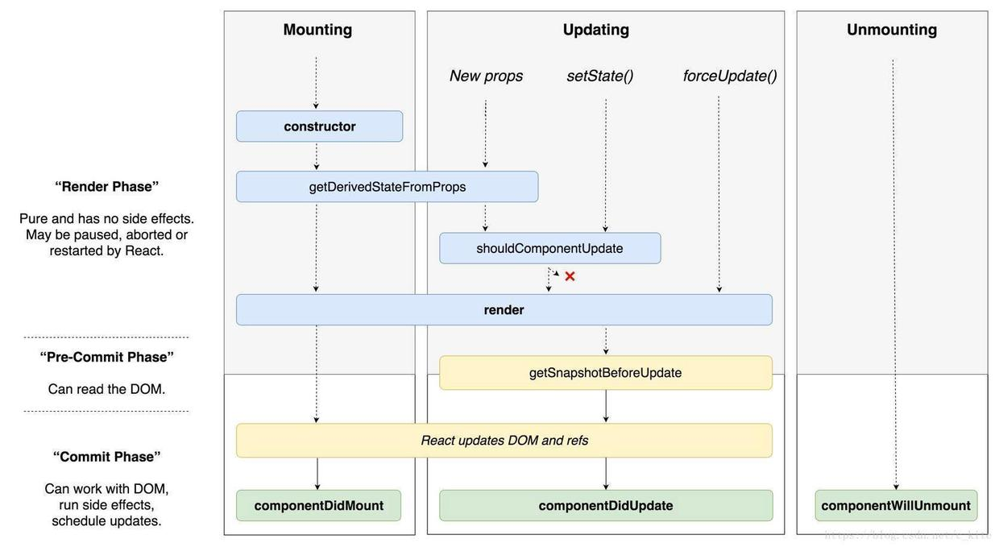

<!-- START doctoc generated TOC please keep comment here to allow auto update -->
<!-- DON'T EDIT THIS SECTION, INSTEAD RE-RUN doctoc TO UPDATE -->
**Table of Contents**  *generated with [DocToc](https://github.com/thlorenz/doctoc)*
# React 文档简记

[React 官网](https://reactjs.org/)  
[React 中文官网](https://react.docschina.org/)

- [Hello World](#hello-world)
- [JSX 简介](#jsx-%E7%AE%80%E4%BB%8B)
  - [JSX 属性](#jsx-%E5%B1%9E%E6%80%A7)
  - [JSX 嵌套](#jsx-%E5%B5%8C%E5%A5%97)
- [元素渲染](#%E5%85%83%E7%B4%A0%E6%B8%B2%E6%9F%93)
- [组件 & Props](#%E7%BB%84%E4%BB%B6--props)
  - [函数定义组件](#%E5%87%BD%E6%95%B0%E5%AE%9A%E4%B9%89%E7%BB%84%E4%BB%B6)
  - [类定义组件](#%E7%B1%BB%E5%AE%9A%E4%B9%89%E7%BB%84%E4%BB%B6)
- [State](#state)
- [生命周期](#%E7%94%9F%E5%91%BD%E5%91%A8%E6%9C%9F)
- [事件处理](#%E4%BA%8B%E4%BB%B6%E5%A4%84%E7%90%86)
- [条件渲染](#%E6%9D%A1%E4%BB%B6%E6%B8%B2%E6%9F%93)
  - [元素变量](#%E5%85%83%E7%B4%A0%E5%8F%98%E9%87%8F)
  - [与运算符 &&](#%E4%B8%8E%E8%BF%90%E7%AE%97%E7%AC%A6-)
  - [三目运算符](#%E4%B8%89%E7%9B%AE%E8%BF%90%E7%AE%97%E7%AC%A6)
  - [阻止组件渲染](#%E9%98%BB%E6%AD%A2%E7%BB%84%E4%BB%B6%E6%B8%B2%E6%9F%93)
- [列表 & Keys](#%E5%88%97%E8%A1%A8--keys)
  - [渲染多个组件](#%E6%B8%B2%E6%9F%93%E5%A4%9A%E4%B8%AA%E7%BB%84%E4%BB%B6)
- [表单](#%E8%A1%A8%E5%8D%95)
  - [受控组件](#%E5%8F%97%E6%8E%A7%E7%BB%84%E4%BB%B6)
  - [多个输入的解决方法](#%E5%A4%9A%E4%B8%AA%E8%BE%93%E5%85%A5%E7%9A%84%E8%A7%A3%E5%86%B3%E6%96%B9%E6%B3%95)
- [状态提升](#%E7%8A%B6%E6%80%81%E6%8F%90%E5%8D%87)
- [组合 vs 继承](#%E7%BB%84%E5%90%88-vs-%E7%BB%A7%E6%89%BF)
  - [包含关系](#%E5%8C%85%E5%90%AB%E5%85%B3%E7%B3%BB)

<!-- END doctoc generated TOC please keep comment here to allow auto update -->

## Hello World

简单示例：
```js
ReactDOM.render(
  <h1>Hello, world!</h1>,
  document.getElementById('root')
);
```

## JSX 简介

1、JSX， 是一种 JavaScript 的语法扩展，其实也是一种表达式。  
2、可以在 JSX 当中使用 JavaScript 表达式，但是要包含在大括号里。  
3、推荐在 JSX 代码的外面扩上一个小括号，这样可以防止分号自动插入的 bug。  
4、Babel 转译器会把 JSX 转换成一个名为 React.createElement() 的方法调用，转化为普通的 JavaScript 对象。  

使用示例：
```js
const element1 = <h1>Hello, world!</h1>;
```

### JSX 属性

```js
// 使用引号来定义以字符串为值的属性
const element = <div tabIndex="0"></div>;
// 使用大括号来定义以 JavaScript 表达式为值的属性
const element = </img>;
```

### JSX 嵌套

```js
// 如果 JSX 标签是闭合式的，那么你需要在结尾处用 />
const element = ;
// JSX 标签可以相互嵌套
const element = (
  <div>
    <h1>Hello!</h1>
    <h2>Good to see you here.</h2>
  </div>
);
```

**注意：** 在 JSX 中，class 变成了 className，tabindex 变成了 tabIndex，for 变成了 htmlFor 。

## 元素渲染

元素是构成 React 应用的最小单位。

元素示例：
```js
const element = <h1>Hello, world</h1>;
```

## 组件 & Props

1、组件从概念上看就像是函数，它可以接收任意的输入值（称之为“props”），并返回一个需要在页面上展示的React元素。  
2、组件名称必须以大写字母开头。  
3、组合组件：组件可以在它的输出中引用其它组件。  
4、提取组件：可以将组件切分为更小的组件。  
5、Props 是只读性的。

### 函数定义组件

```js
function Welcome(props) {
  return <h1>Hello, {props.name}</h1>;
}
```

### 类定义组件

```js
class Welcome extends React.Component {
  render() {
    return <h1>Hello, {this.props.name}</h1>;
  }
}
```

## State

1、状态与属性相似，但是状态是私有的，完全受控于当前组件。  
2、使用类构造函数来初始化状态 this.state。  
3、不要直接更新状态，应当使用 setState()。  
4、调用 setState() 时，React 将你提供的对象浅合并到当前状态。
5、this.props 和 this.state 可能是异步更新的，不应该依靠它们的值来计算下一个状态。  
6、数据自顶向下流动（单向数据流）。  

使用示例：
```js
class Clock extends React.Component {
  constructor(props) {
    super(props);
    this.state = {date: new Date()};
  }
  tick() {
    this.setState({
      date: new Date()
    });
  }
  update() {
    this.setState((prevState, props) => ({
      counter: prevState.counter + props.increment
    }));
  }
}
```

## 生命周期

```js
class ExampleComponent extends React.Component {
  // 用于初始化 state
  constructor() {}
  // 用于替换 `componentWillReceiveProps` ，该函数会在初始化和 `update` 时被调用
  // 因为该函数是静态函数，所以取不到 `this`
  // 如果需要对比 `prevProps` 需要单独在 `state` 中维护
  static getDerivedStateFromProps(nextProps, prevState) {}
  // 判断是否需要更新组件，多用于组件性能优化
  shouldComponentUpdate(nextProps, nextState) {}
  // 组件挂载后调用
  // 可以在该函数中进行请求或者订阅
  componentDidMount() {}
  // 用于获得最新的 DOM 数据
  getSnapshotBeforeUpdate(prevProps, prevState) {}
  // 组件即将销毁
  // 可以在此处移除订阅，定时器等等
  componentWillUnmount() {}
  // 组件销毁后调用
  componentDidUnMount() {}
  // 组件更新后调用
  componentDidUpdate() {}
  // 渲染组件函数
  render() {}
  // 以下函数不建议使用
  UNSAFE_componentWillMount() {}
  UNSAFE_componentWillUpdate(nextProps, nextState) {}
  UNSAFE_componentWillReceiveProps(nextProps) {}
}
```



## 事件处理

1、React事件绑定属性的命名采用驼峰式写法，而不是小写。
2、不能使用返回 false 的方式阻止默认行为，而是使用 preventDefault。

示例：处理事件的三种方法
```js
class Toggle extends React.Component {
  constructor(props) {
    super(props);
    // This binding is necessary to make `this` work in the callback
    this.handleClick1 = this.handleClick1.bind(this);
  }

  handleClick1() {
    this.setState({...})
  }
  
  handleClick2 = () => {
    ...
  }

  handleClick3 = () => {
    ...
  }

  render() {
    return (
      <div>
        <button onClick={this.handleClick1}>按钮1</button>
        <button onClick={this.handleClick2}>按钮2</button>
        <button onClick={(e) => this.handleClick3(e)}}>按钮3</button>
      </div>
    );
  }
}

```

示例：向事件处理程序传递参数
```js
class Toggle extends React.Component {
  constructor(props) {
    super(props);
    this.state = {name:'Hello world!'};
  }

  deleteRow(id, e) {
    ...
  }

  render() {
    return (
      <div>
        <button onClick={(e) => this.deleteRow(id, e)}>Delete Row</button>
        <button onClick={this.deleteRow.bind(this, id)}>Delete Row</button>
      </div>
    );
  }
}

```
**注意：**  
1、参数 e 作为 React 事件对象将会被作为最后一个参数进行传递。
2、通过箭头函数的方式，事件对象必须显式的进行传递。  
3、通过 bind 的方式，事件对象以及更多的参数将会被隐式的进行传递。  

## 条件渲染

### 元素变量

```js
render() {
  const isLoggedIn = this.state.isLoggedIn;
    
  let button = null;
  if (isLoggedIn) {
    button = <LogoutButton onClick={this.handleLogoutClick} />;
  } else {
    button = <LoginButton onClick={this.handleLoginClick} />;
  }
    
  return (
    <div>
      <Greeting isLoggedIn={isLoggedIn} />
      {button}
    </div>
  );
}
```

### 与运算符 &&

```js
function Mailbox(props) {
  const unreadMessages = props.unreadMessages;
  return (
    <div>
      <h1>Hello!</h1>
      {unreadMessages.length > 0 &&
        <h2>
          You have {unreadMessages.length} unread messages.
        </h2>
      }
    </div>
  );
}
```

### 三目运算符

```js
render() {
  const isLoggedIn = this.state.isLoggedIn;
  return (
    <div>
      The user is <b>{isLoggedIn ? 'currently' : 'not'}</b> logged in.
    </div>
  );
}
```

### 阻止组件渲染

warn 的值是 false，则组件不会渲染。
```js
render() {
  return (
    <div>
      <WarningBanner warn={this.state.showWarning} />
    </div>
  );
}
```

## 列表 & Keys

1、Keys可以在DOM中的某些元素被增加或删除的时候帮助React识别哪些元素发生了变化。  
2、元素的key在他的兄弟元素之间应该唯一。  

### 渲染多个组件

```js
const numbers = [1, 2, 3, 4, 5];
const listItems = numbers.map((number) =>
  <li key={number.toString()}>{number}</li>
);

ReactDOM.render(
  <ul>{listItems}</ul>,
  document.getElementById('root')
);
```

## 表单

### 受控组件

由React控制的输入表单元素称为“受控组件”。

示例：
```js
render() {
  return (
    <form onSubmit={this.handleSubmit}>
      <input type="text" value={this.state.value} onChange={this.handleChange}/>
      <textarea value={this.state.value} onChange={this.handleChange} />
      <select value={this.state.value} onChange={this.handleChange}>
        <option value="grapefruit">Grapefruit</option>
        <option value="lime">Lime</option>
      </select>
    </form>
  );
}
```

### 多个输入的解决方法

示例：
```js
class Reservation extends React.Component {
  constructor(props) {
    super(props);
    this.state = {
      isGoing: true,
      numberOfGuests: 2
    };

    this.handleInputChange = this.handleInputChange.bind(this);
  }

  handleInputChange(event) {
    const target = event.target;
    const value = target.type === 'checkbox' ? target.checked : target.value;
    const name = target.name;

    this.setState({
      [name]: value
    });
  }

  render() {
    return (
      <form>
        <label>
          Is going:
          <input
            name="isGoing"
            type="checkbox"
            checked={this.state.isGoing}
            onChange={this.handleInputChange} />
        </label>
        <br />
        <label>
          Number of guests:
          <input
            name="numberOfGuests"
            type="number"
            value={this.state.numberOfGuests}
            onChange={this.handleInputChange} />
        </label>
      </form>
    );
  }
}
```

## 状态提升

在React应用中，对应任何可变数据理应只有一个单一“数据源”。将多个组件共享的状态提升至他们最近的父组件当中进行管理。

## 组合 vs 继承

建议使用组合而不是继承来复用组件之间的代码。

### 包含关系

使用 children 属性将子元素直接传递到输出。
```js
function FancyBorder(props) {
  return (
    <div className={'FancyBorder FancyBorder-' + props.color}>
      {props.children}
    </div>
  );
}
```
