<!-- START doctoc generated TOC please keep comment here to allow auto update -->
<!-- DON'T EDIT THIS SECTION, INSTEAD RE-RUN doctoc TO UPDATE -->
**Table of Contents**  *generated with [DocToc](https://github.com/thlorenz/doctoc)*

# Vue 数据绑定

- [一、访问器属性](#%E4%B8%80%E8%AE%BF%E9%97%AE%E5%99%A8%E5%B1%9E%E6%80%A7)
- [二、极简双向绑定的实现](#%E4%BA%8C%E6%9E%81%E7%AE%80%E5%8F%8C%E5%90%91%E7%BB%91%E5%AE%9A%E7%9A%84%E5%AE%9E%E7%8E%B0)
- [三、分解任务](#%E4%B8%89%E5%88%86%E8%A7%A3%E4%BB%BB%E5%8A%A1)
- [四、DocumentFragment](#%E5%9B%9Bdocumentfragment)
- [五、数据初始化绑定](#%E4%BA%94%E6%95%B0%E6%8D%AE%E5%88%9D%E5%A7%8B%E5%8C%96%E7%BB%91%E5%AE%9A)
- [六、响应式的数据绑定](#%E5%85%AD%E5%93%8D%E5%BA%94%E5%BC%8F%E7%9A%84%E6%95%B0%E6%8D%AE%E7%BB%91%E5%AE%9A)
- [七、订阅/发布模式（subscribe&publish）](#%E4%B8%83%E8%AE%A2%E9%98%85%E5%8F%91%E5%B8%83%E6%A8%A1%E5%BC%8Fsubscribepublish)
- [八、双向绑定的实现](#%E5%85%AB%E5%8F%8C%E5%90%91%E7%BB%91%E5%AE%9A%E7%9A%84%E5%AE%9E%E7%8E%B0)

<!-- END doctoc generated TOC please keep comment here to allow auto update -->

### SEE ALSO
[Vue.js双向绑定的实现原理](https://www.cnblogs.com/kidney/p/6052935.html)  
[剖析Vue原理&实现双向绑定MVVM](https://segmentfault.com/a/1190000006599500#articleHeader0)

前置知识：
ES5中的对象的属性可以分为数据属性和访问器属性。
- 数据属性特性：value、writable、enumerable、configurable。
- 访问器属性特性：set、get、enumerable、configurable。

## 一、访问器属性

访问器属性是对象中的一种特殊属性，它不能直接在对象中设置，而必须通过 defineProperty() 方法单独定义。

```js
var obj = {};
// 为obj定义一个名为 hello 的访问器属性
Object.defineProperty(obj, "hello", {
  get: function () {return sth},
  set: function (val) {/* do sth */}
})
obj.hello // 可以像普通属性一样读取访问器属性
```

访问器属性的"值"比较特殊，读取或设置访问器属性的值，实际上是调用其内部特性：get和set函数。

```js
obj.hello // 读取属性，就是调用get函数并返回get函数的返回值
obj.hello = "abc" // 为属性赋值，就是调用set函数，赋值其实是传参 
```

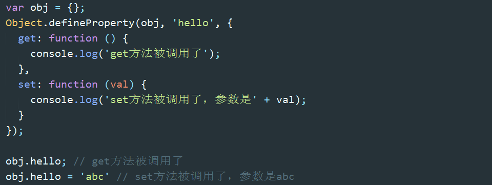

get 和 set 方法内部的 this 都指向 obj，这意味着 get 和 set 函数可以操作对象内部的值。另外，访问器属性的会"覆盖"同名的普通属性，因为访问器属性会被优先访问，与其同名的普通属性则会被忽略。

## 二、极简双向绑定的实现

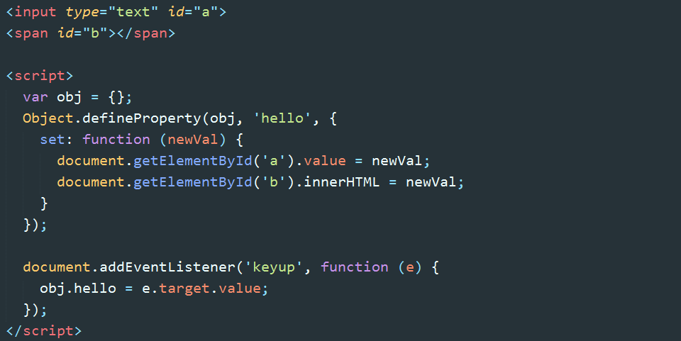

此例实现的效果是：随文本框输入文字的变化，span 中会同步显示相同的文字内容；在js或控制台显式的修改 obj.hello 的值，视图会相应更新。这样就实现了 model => view 以及 view => model 的双向绑定。


以上就是 Vue 实现双向绑定的基本原理。

## 三、分解任务

上述示例仅仅是为了说明原理。我们最终要实现的是：

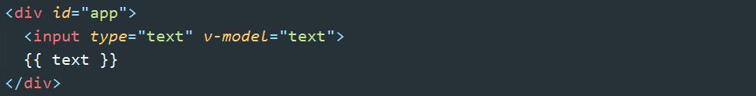
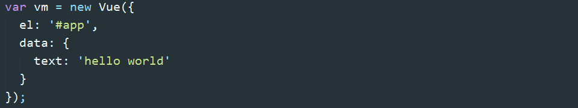

首先将该任务分成几个子任务：

- 1、输入框以及文本节点与 data 中的数据绑定
- 2、输入框内容变化时，data 中的数据同步变化。即 view => model 的变化。
- 3、data 中的数据变化时，文本节点的内容同步变化。即 model => view 的变化。

要实现任务一，需要对 DOM 进行编译，这里有一个知识点：DocumentFragment。

## 四、DocumentFragment

DocumentFragment（文档片段）可以看作节点容器，它可以包含多个子节点，当我们将它插入到 DOM 中时，只有它的子节点会插入目标节点，所以把它看作一组节点的容器。使用 DocumentFragment 处理节点，速度和性能远远优于直接操作 DOM。Vue 进行编译时，就是将挂载目标的所有子节点劫持（真的是劫持，通过 append 方法，DOM 中的节点会被自动删除）到 DocumentFragment 中，经过一番处理后，再将 DocumentFragment 整体返回插入挂载目标。

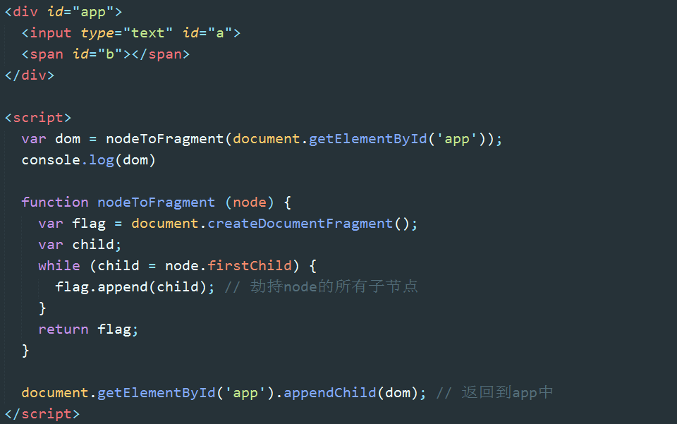

`#` 勘误：flag.append() 应为 flag.appendChild()。下同。在 Chrome 中用 append() 竟然正常，没报错。

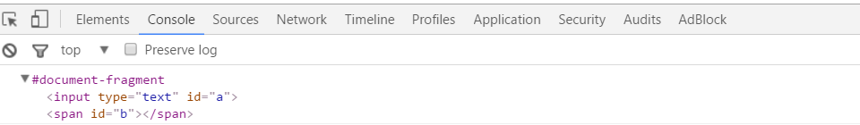

## 五、数据初始化绑定

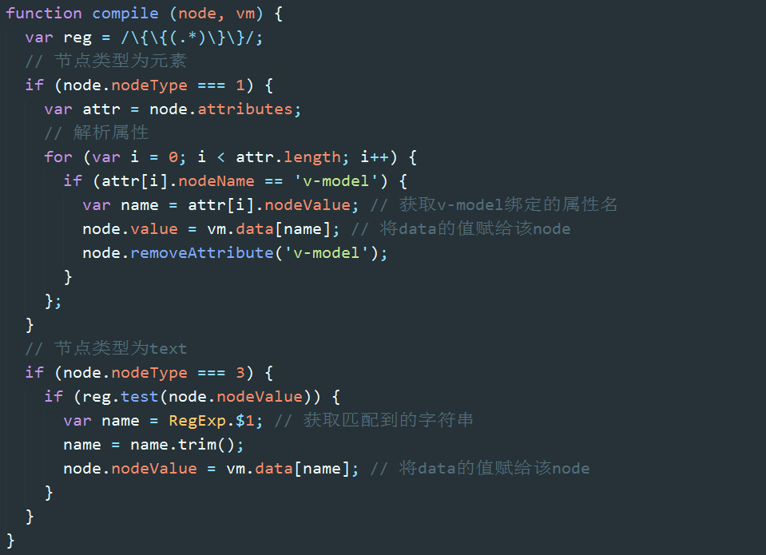
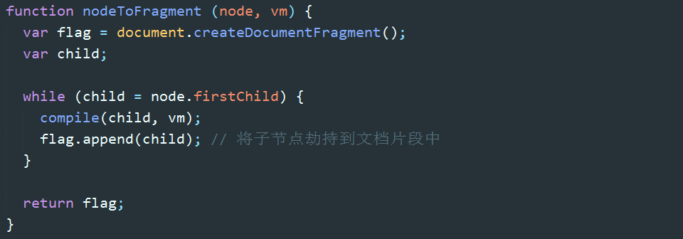
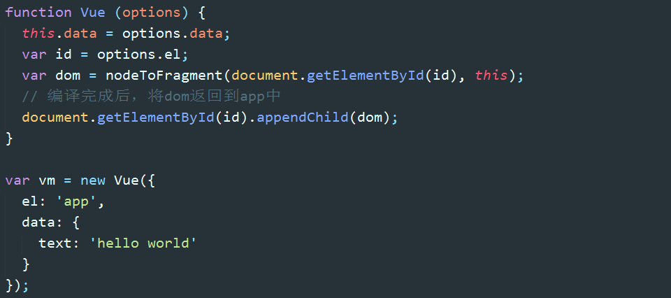

以上代码实现了任务一，我们可以看到，hello world已经呈现在输入框和文本节点中。
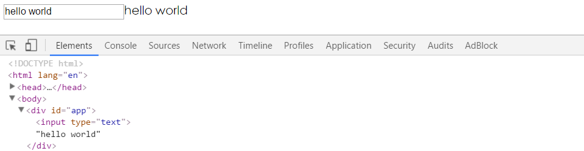

## 六、响应式的数据绑定

再来看任务二的实现思路：当我们在输入框输入数据的时候，首先触发 input 事件（或者 keyup、change 事件），在相应的事件处理程序中，我们获取输入框的 value 并赋值给 vm 实例的 text 属性。我们会利用 defineProperty 将 data 中的 text 设置为 vm 的访问器属性，因此给 vm.text 赋值，就会触发 set 方法。在 set 方法中主要做两件事，第一是更新属性的值，第二留到任务三再说。

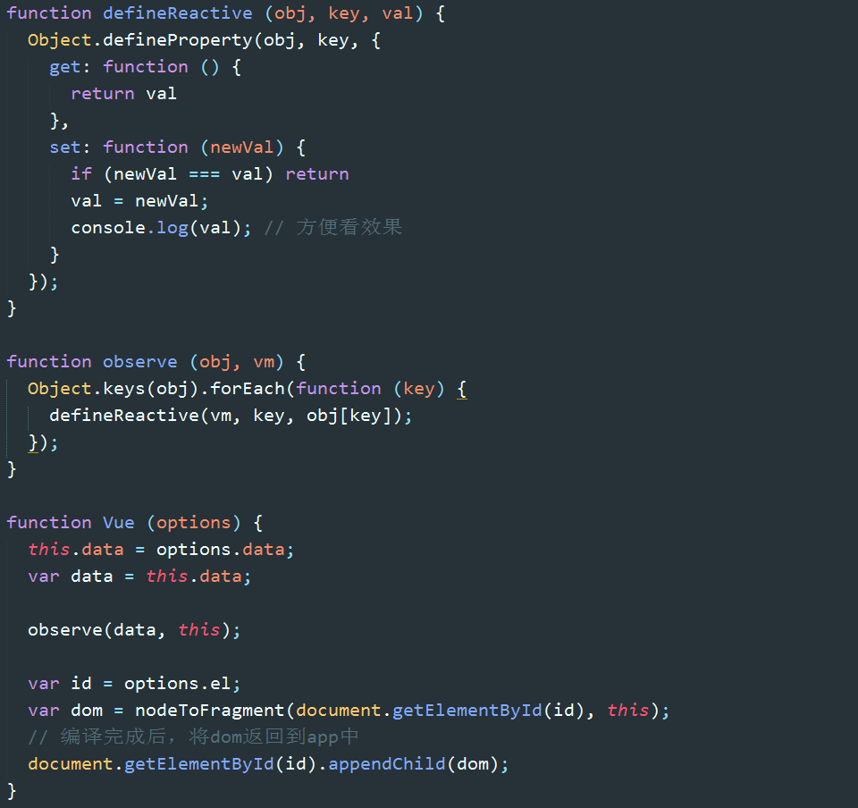
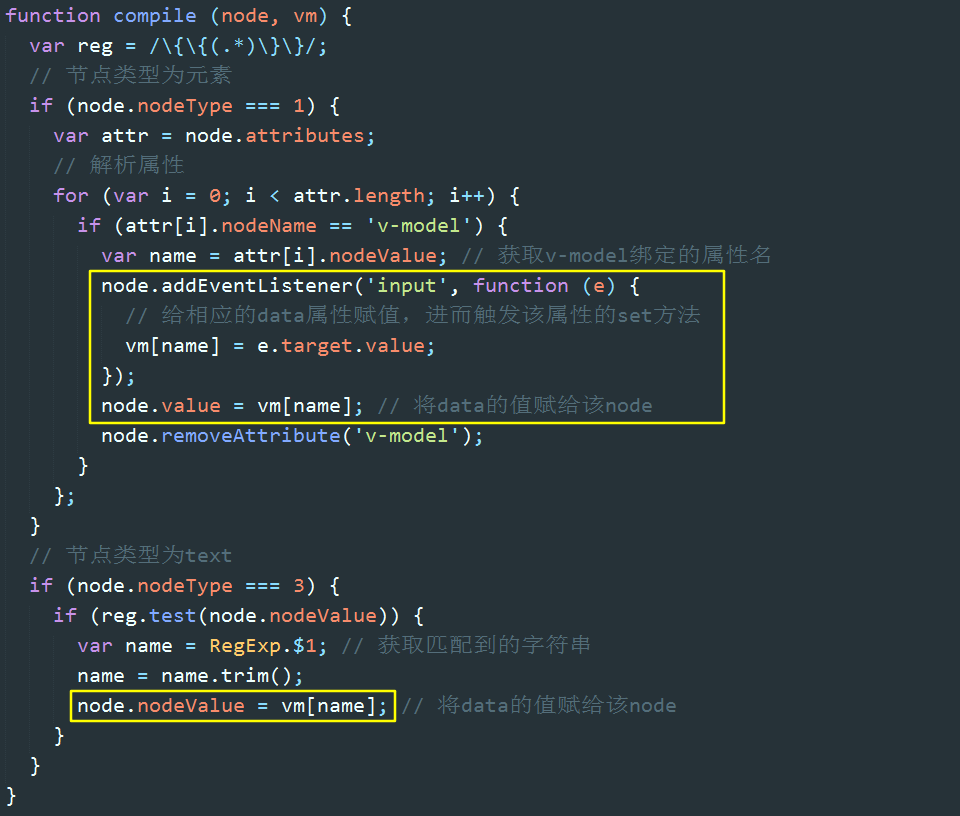

任务二也就完成了，text 属性值会与输入框的内容同步变化：
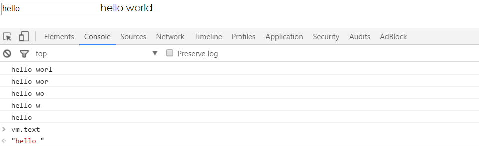

## 七、订阅/发布模式（subscribe&publish）

 text 属性变化了，set 方法触发了，但是文本节点的内容没有变化。如何让同样绑定到 text 的文本节点也同步变化呢？这里又有一个知识点：订阅发布模式。

订阅发布模式（又称观察者模式）定义了一种一对多的关系，让多个观察者同时监听某一个主题对象，这个主题对象的状态发生改变时就会通知所有观察者对象。

发布者发出通知 => 主题对象收到通知并推送给订阅者 => 订阅者执行相应操作


之前提到的，当 set 方法触发后做的第二件事就是作为发布者发出通知：“我是属性 text，我变了”。文本节点则是作为订阅者，在收到消息后执行相应的更新操作。

## 八、双向绑定的实现

回顾一下，每当 new 一个 Vue，主要做了两件事：第一个是监听数据：observe(data)，第二个是编译 HTML：nodeToFragement(id)。

在监听数据的过程中，会为 data 中的每一个属性生成一个主题对象 dep。

在编译 HTML 的过程中，会为每个与数据绑定相关的节点生成一个订阅者 watcher，watcher 会将自己添加到相应属性的 dep 中。

我们已经实现：修改输入框内容 => 在事件回调函数中修改属性值 => 触发属性的 set 方法。

接下来我们要实现的是：发出通知 dep.notify() => 触发订阅者的 update 方法 => 更新视图。

这里的关键逻辑是：如何将 watcher 添加到关联属性的 dep 中。


在编译 HTML 过程中，为每个与 data 关联的节点生成一个 Watcher。Watcher 函数中发生了什么呢？
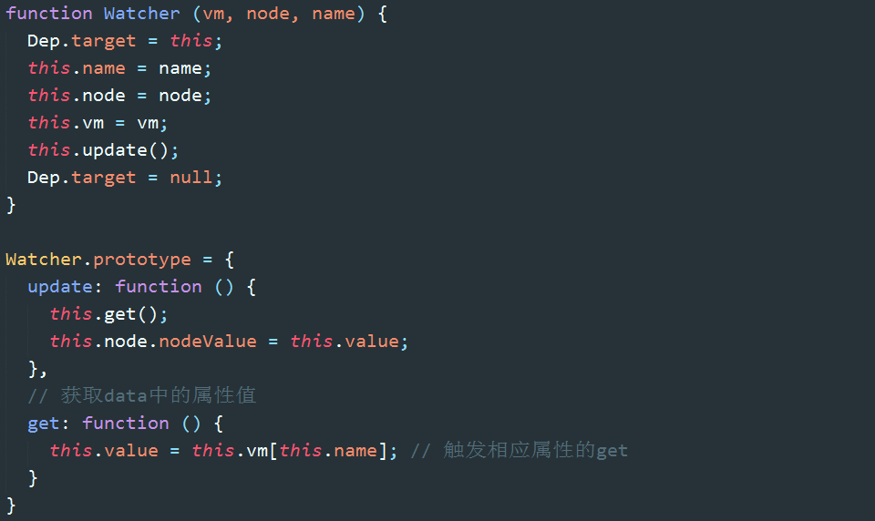

首先，将自己赋给了一个全局变量 Dep.target；

其次，执行了 update 方法，进而执行了 get 方法，get 的方法读取了 vm 的访问器属性，从而触发了访问器属性的 get 方法，get 方法中将该 watcher 添加到了对应访问器属性的 dep 中；

再次，获取属性的值，然后更新视图。

最后，将 Dep.target 设为空。因为它是全局变量，也是 watcher 与 dep 关联的唯一桥梁，任何时刻都必须保证 Dep.target 只有一个值。
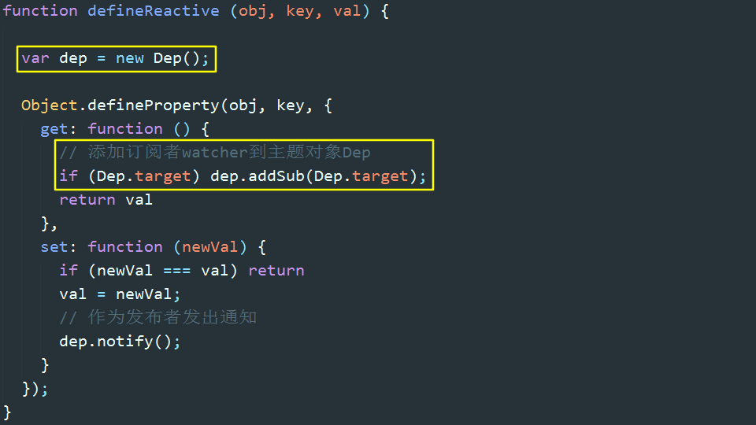
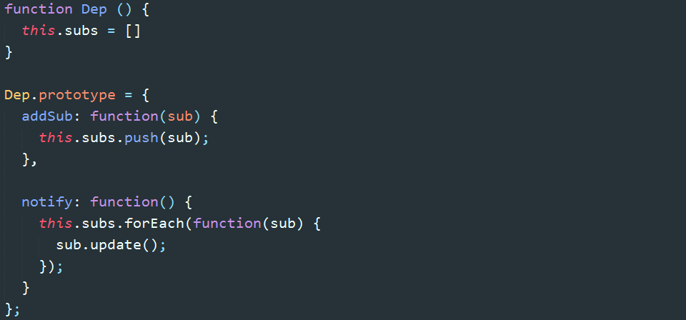

至此，hello world 双向绑定就基本实现了。文本内容会随输入框内容同步变化，在控制器中修改 vm.text 的值，会同步反映到文本内容中。
